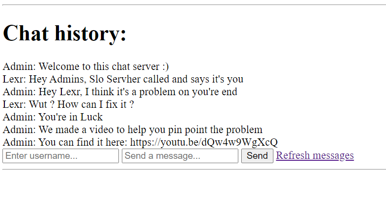

# Multi-threaded chat server in Rust with Tokio
 
Simple server to skill up in Rust and Tokio.

## Notes:
- Each incoming request spins up a tokio task => the server can handle multiple requests at the time.
- The conversation history is the only mutable shared state between the tokio tasks. 
    - So i chose to store it on the heap and protected it with a reference-counting pointer and a mutex (``` Arc<Mutex<Vec<(String, String)>>> ```). 
    - I may do the message passing between tokio tasks option in the future.
- Shortcomings:
    - The client only communicates to the backend through GET requests.
    - You have to constantly renter your username.
- You can find a containerized version of it in the "containerize-it-Docker" branch.

I know the html sucks, but the focus was on the backend.

## How it looks like
<p align = "center">
    
</p>
